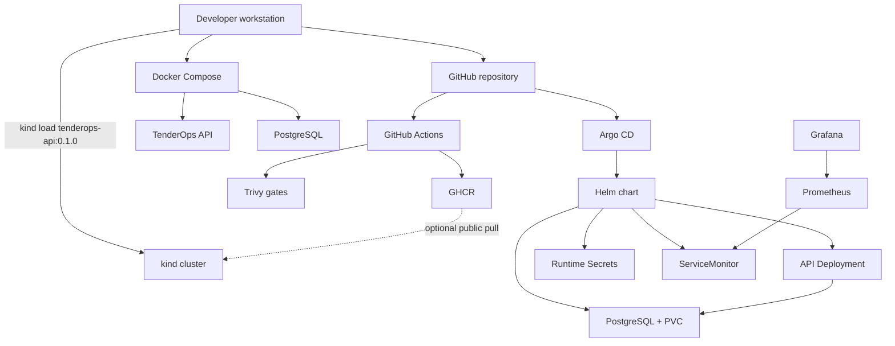

# TenderOps Lab

TenderOps Lab is a local-first DevOps, GitOps, security, and observability lab.

It wraps a small Spring Boot + PostgreSQL API in a delivery path that can be demonstrated on a developer machine:

```text
Spring Boot API
→ Maven build/test
→ Docker image
→ Docker Compose
→ kind Kubernetes
→ Helm
→ Argo CD GitOps
→ Trivy security scanning
→ Prometheus / Grafana
```

The application domain is intentionally simple. The project exists to show the platform and workflow around the service, not a production tender-management product.

This repository is **portfolio-ready** and **not production-ready**.

## Overview

TenderOps API is a small tender-management service. PostgreSQL stores tender records. Flyway versions the schema.

The useful demo surface is operational:

- `GET /api/tenders` and `GET /api/tenders/summary`
- Spring Boot Actuator health, metrics, info, and Prometheus scrape endpoints
- Kubernetes probes, GitOps sync, Trivy gates, and Grafana dashboards

Deeper narrative: [docs/project-walkthrough.md](docs/project-walkthrough.md).

## What this project demonstrates

- Repeatable Maven test and Docker image builds
- Local multi-container development with Docker Compose
- Local Kubernetes on kind
- Helm packaging of API, PostgreSQL, probes, resources, and hardening
- Argo CD syncing desired state from Git
- GitHub Actions for tests, Trivy security gates, Helm lint, and GHCR image publish
- Runtime Kubernetes Secrets instead of committed Helm passwords
- A PostgreSQL NetworkPolicy limited to API Pods
- Prometheus scraping through a ServiceMonitor
- A local Grafana dashboard for the API

## Architecture

Two local paths exist. Docker Compose is the fastest developer loop. The active Kubernetes path is:

```text
Helm chart → Argo CD → kind cluster
```

GitHub Actions validates and can publish `ghcr.io/tasi-ts/tenderops-api`. The kind demo still loads `tenderops-api:0.1.0` locally unless GHCR visibility and pull access are configured.



Sketch of the two local paths. Object-level notes: [docs/architecture.md](docs/architecture.md).

## Technology stack

| Area | Tools |
| --- | --- |
| API | Java 21, Spring Boot, Maven Wrapper, Flyway |
| Data | PostgreSQL 16 |
| Local run | Docker, Docker Compose |
| Kubernetes | kind, Helm, Argo CD |
| CI / registry | GitHub Actions, GHCR |
| Security | Trivy, container/Pod security contexts, NetworkPolicy |
| Observability | Actuator, Prometheus, Grafana, ServiceMonitor |
| Agent workflows | Cursor security remediation and posture-review runbooks |

## Local quickstart

Prerequisites: Docker and Docker Compose. Java 21 is optional if you only run containers.

From the repository root:

```bash
docker compose up --build -d
```

Compose publishes the API on `localhost:8080` and PostgreSQL on `localhost:5433`. Demo credentials are local-only (`tenderops` / `tenderops`).

```bash
curl http://localhost:8080/actuator/health
curl http://localhost:8080/api/tenders | jq
curl http://localhost:8080/api/tenders/summary
```

Expected summary payload:

```json
{"service":"tenderops-api","tenderCount":2,"status":"running"}
```

Stop the stack:

```bash
docker compose down
```

Local test/image check without Compose:

```bash
./scripts/ci/api-check.sh
```

## Kubernetes / GitOps demo path

This path assumes Docker, kind, kubectl, Helm, and a local cluster named `tenderops`. Command details live in [docs/demo-commands.md](docs/demo-commands.md).

Typical flow:

1. Create or reuse the kind cluster.
2. Install kube-prometheus-stack into `monitoring` so ServiceMonitor CRDs exist.
3. Install Argo CD into `argocd`.
4. Create namespace `tenderops` and the runtime Secrets documented in [charts/README.md](charts/README.md).
5. Build and load the local API image:

```bash
docker build -t tenderops-api:0.1.0 ./src/api
kind load docker-image tenderops-api:0.1.0 --name tenderops
```

6. Apply the Argo CD Application in `gitops/apps/tenderops-application.yaml`.
7. Confirm sync and health, then port-forward the API:

```bash
kubectl get applications -n argocd
kubectl get pods -n tenderops
kubectl port-forward -n tenderops svc/tenderops-api 8080:8080
```

Argo CD watches `https://github.com/tasi-ts/tenderops-lab.git` on `main` and deploys `charts/tenderops` into namespace `tenderops`. Raw manifests in `k8s/base/` are learning/reference material only.

## Security and hardening

Local scan (advisory; does not fail the shell):

```bash
./scripts/security/scan-local.sh
```

CI (`.github/workflows/security.yml`) fails on HIGH/CRITICAL Trivy findings and runs Helm lint. Details: [docs/security-hardening.md](docs/security-hardening.md) and [docs/ci-cd.md](docs/ci-cd.md).

Implemented in the lab:

- Trivy filesystem, secret, image, and rendered Kubernetes scans
- non-root API user, dropped capabilities, read-only root filesystem, seccomp `RuntimeDefault`
- Helm default `secrets.create: false` with pre-created runtime Secrets
- NetworkPolicy limiting PostgreSQL ingress to API Pods on TCP 5432

## Observability

Actuator endpoints used in this lab (Compose / Helm / `k8s/base`):

- `/actuator/health`, `/actuator/health/liveness`, `/actuator/health/readiness`
- `/actuator/info`
- `/actuator/metrics`
- `/actuator/prometheus`

Kubernetes probes use the liveness and readiness endpoints. Prometheus scrapes `/actuator/prometheus` through a ServiceMonitor. Grafana is installed with the local kube-prometheus-stack values in `observability/`.

```bash
kubectl port-forward -n monitoring svc/monitoring-kube-prometheus-prometheus 9090:9090
kubectl port-forward -n monitoring svc/monitoring-grafana 3000:80
```

Local Grafana credentials are `admin` / `admin`. Do not reuse them outside this lab.

Queries, dashboard notes, and production Actuator warnings: [docs/observability.md](docs/observability.md).

## Repository structure

```text
src/api/              Spring Boot API
docker/               Docker notes
compose.yaml          Local Compose stack
k8s/base/             Raw Kubernetes learning/reference manifests
charts/tenderops/     Active Helm chart
gitops/apps/          Argo CD Application
scripts/ci/           Local CI helper
scripts/security/     Local Trivy helper
observability/        kube-prometheus-stack values
docs/                 Architecture, walkthrough, security, observability
agents/               Cursor DevSecOps agent runbooks
infra/                Reserved for a later Terraform/Azure option
```

## Local-only assumptions

- Docker Compose and Kubernetes demo credentials are for this lab only
- Grafana `admin` / `admin` is local-only
- Runtime Secrets are created manually in kind
- Actuator health details are shown for local inspection
- The API has no authentication
- Access is via Compose ports or `kubectl port-forward`, not public Ingress/TLS
- kind uses the locally loaded `tenderops-api:0.1.0` image unless GHCR is made pullable
- A private GitHub repo needs an Argo CD repository credential; a public repo should not

## Production gaps

This lab does not claim production readiness. Remaining gaps include:

- external secret management and rotation
- API authentication and authorization
- Ingress, TLS, and restricted Actuator exposure
- registry-based image promotion by digest into the cluster
- PostgreSQL backup/restore
- Loki, alerting, tracing, and production dashboard/retention design
- GitOps environment separation and approval gates
- cloud infrastructure (Terraform/Azure is an optional later segment)

## Documentation map

### Hub and narrative

| Document | Contents |
| --- | --- |
| [docs/project-walkthrough.md](docs/project-walkthrough.md) | Demo narrative |
| [docs/project-review-summary.md](docs/project-review-summary.md) | Technical Q&A and talking points |
| [docs/project-goals.md](docs/project-goals.md) | Goals and non-goals |
| [docs/learning-roadmap.md](docs/learning-roadmap.md) | Completed and planned learning path |
| [docs/architecture.md](docs/architecture.md) | Architecture diagrams |
| [docs/demo-commands.md](docs/demo-commands.md) | Command transcript for demos |

### Topic docs

| Document | Contents |
| --- | --- |
| [docs/observability.md](docs/observability.md) | Prometheus, Grafana, Actuator |
| [docs/security-hardening.md](docs/security-hardening.md) | Scanning, hardening, residual risk |
| [docs/ci-cd.md](docs/ci-cd.md) | GitHub Actions and GHCR |
| [docs/public-release-checklist.md](docs/public-release-checklist.md) | Public repo, GHCR, and v0.1 tag checklist |
| [docs/security-agent-roadmap.md](docs/security-agent-roadmap.md) | Pointer to Cursor agent workflows |
| [docs/decisions/0001-local-first-devops-lab.md](docs/decisions/0001-local-first-devops-lab.md) | ADR: local-first lab |
| [docs/decisions/0002-helm-argocd-gitops.md](docs/decisions/0002-helm-argocd-gitops.md) | ADR: Helm and Argo CD |

### Folder READMEs

| Document | Contents |
| --- | --- |
| [charts/README.md](charts/README.md) | Helm chart and runtime Secrets |
| [gitops/apps/README.md](gitops/apps/README.md) | Argo CD Application |
| [k8s/README.md](k8s/README.md) | Raw manifests (learning subset) |
| [src/api/README.md](src/api/README.md) | API commands and endpoints |
| [docker/README.md](docker/README.md) | Image build and Compose |
| [scripts/README.md](scripts/README.md) | Local CI and Trivy helpers |
| [observability/README.md](observability/README.md) | kube-prometheus-stack values |
| [agents/README.md](agents/README.md) | Cursor security agent workflows |
| [infra/README.md](infra/README.md) | Reserved Terraform/Azure notes |

## License

This project is licensed under the [MIT License](LICENSE).
