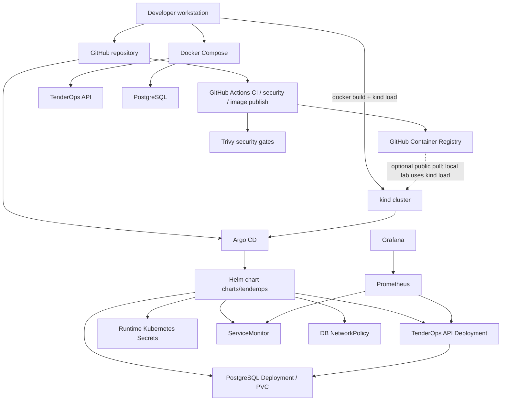

# Architecture

TenderOps Lab demonstrates a small Spring Boot API moving through a local DevOps delivery path.

The active Kubernetes path is:

```text
Helm chart → Argo CD → kind cluster
```

Docker Compose remains the fastest local development path. GitHub Actions validates the repository and can publish an image to GHCR. The kind demo still loads `tenderops-api:0.1.0` locally unless GHCR visibility and pull access are configured.

This is a local-first lab. It is not a cloud production architecture.

## End-to-end diagram



## Application architecture

```text
Client / curl
  |
  v
tenderops-api
  |
  v
PostgreSQL
```

The API is a Java 21 / Spring Boot service. PostgreSQL stores tender records. Flyway applies versioned schema migrations at startup.

## Local development architecture

```text
Developer machine
  |
  +-- Maven Wrapper build/test
  |
  +-- Docker image build
  |
  +-- Docker Compose
        |
        +-- API container   (localhost:8080)
        +-- PostgreSQL      (localhost:5433 → 5432)
```

Compose uses local-only demo credentials. See `compose.yaml`.

## Kubernetes architecture

```text
kind cluster (name: tenderops)
  |
  +-- namespace: argocd
  |     +-- Argo CD
  |
  +-- namespace: monitoring
  |     +-- Prometheus
  |     +-- Grafana
  |
  +-- namespace: tenderops
        |
        +-- runtime Secrets
        |     +-- tenderops-api-runtime-secret
        |     +-- tenderops-db-runtime-secret
        |
        +-- tenderops-api Deployment (2 replicas)
        |     +-- ClusterIP Service
        |     +-- ServiceMonitor → /actuator/prometheus
        |     +-- Grafana dashboard ConfigMap
        |
        +-- tenderops-db Deployment (1 replica)
              +-- ClusterIP Service
              +-- PersistentVolumeClaim
              +-- NetworkPolicy (API Pods → TCP 5432)
```

## Delivery architecture

```text
GitHub repository
  |
  +-- GitHub Actions
  |     +-- ci.yml              Maven tests + Docker build
  |     +-- security.yml        Trivy gates + Helm lint
  |     +-- image-publish.yml   GHCR publish
  |
  +-- Argo CD Application
        +-- watches charts/tenderops on main
        +-- syncs namespace tenderops
```

CI does not deploy to the cluster. Argo CD reconciles Kubernetes from Git.

Raw manifests in `k8s/base/` match the Helm chart closely enough for learning, but they are not the active delivery path.

## Security and observability

```text
Spring Boot Actuator
  |
  +-- health / liveness / readiness
  +-- metrics
  +-- /actuator/prometheus

Prometheus
  |
  +-- ServiceMonitor in tenderops
  +-- scrape API metrics

Grafana
  |
  +-- local kube-prometheus-stack
  +-- TenderOps API dashboard ConfigMap

Trivy
  |
  +-- filesystem / dependency scan
  +-- secret scan
  +-- Docker image scan
  +-- Kubernetes/Helm misconfiguration scan
  +-- CI HIGH/CRITICAL gates
```

## Image source note

Published image pattern (when the publish workflow has run):

```text
ghcr.io/tasi-ts/tenderops-api:main
ghcr.io/tasi-ts/tenderops-api:sha-<commit>
```

Helm default image:

```text
tenderops-api:0.1.0
```

Until GHCR is public (or kind has an imagePullSecret), reload the local image after API, Dockerfile, or dependency changes:

```bash
docker build -t tenderops-api:0.1.0 ./src/api
kind load docker-image tenderops-api:0.1.0 --name tenderops
kubectl rollout restart deployment/tenderops-api -n tenderops
```
